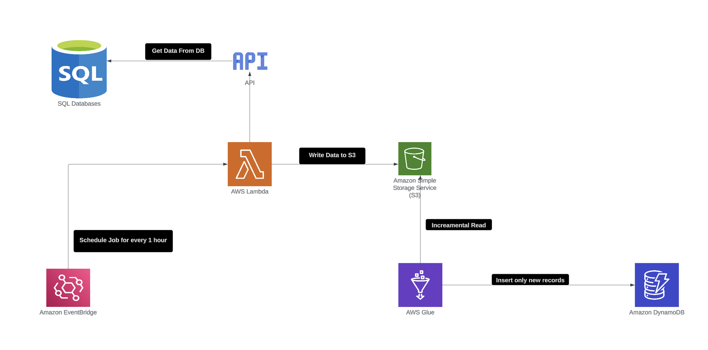

# Real Time Streaming Data Engineering Project

## Introduction 
In this project, you will execute an End-To-End Data Engineering Project on AWS by generating Real time data.

We are going to use different technologies such as Python, Amazon Web Services (AWS), Glue, Athena, and DynamoDB.

## Architecture 

## Technology Used
- Programming Language - Python
- Amazon Web Service (AWS)
1. S3 (Simple Storage Service)
2. Glue Crawler
3. DynamoDB
4. EventBridge
5. Lambda

